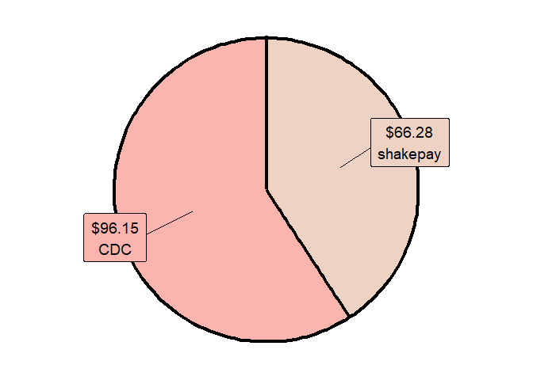
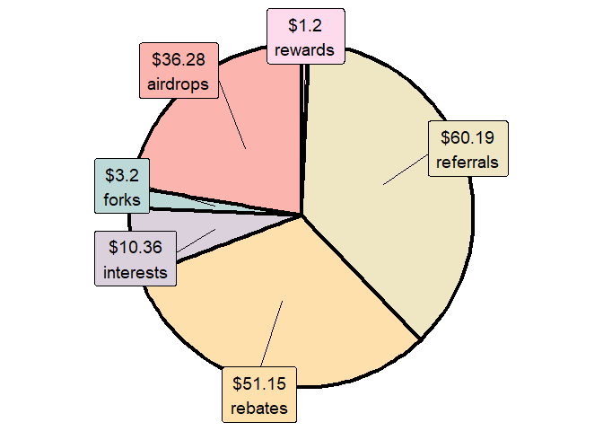

<!-- README.md is generated from README.Rmd. Please edit that file -->
<!-- badges: start -->

[](https://github.com/cryptoltruist/cryptoTax/actions/workflows/R-CMD-check.yaml)
[](https://app.codecov.io/gh/cryptoltruist/cryptoTax?branch=main)
<!-- badges: end -->

# cryptoTax: Crypto taxes in R (Canada only) 

*Disclaimer: This is not financial advice. Use at your own risks. There
are no guarantees whatsoever in relation to the use of this package.
Please consult a tax professional as necessary*.

------------------------------------------------------------------------

Helps calculate crypto taxes in R.

1.  First, by allowing you to format .CSV files from various exchanges
    to one large dataframe of organized transactions.
2.  Second, by allowing you to calculate your Adjusted Cost Base (ACB),
    ACB per share, and realized and unrealized capital gains/losses.
3.  Third, by calculating revenues gained from staking, interest,
    airdrops, etc.
4.  Fourth, by calculating superficial losses as well, if desired.

This is a work in progress. If you notice bugs, please report them:
<https://github.com/cryptoltruist/cryptoTax/issues>.

# Why use `cryptoTax`?

What are the benefits of using an R package to do your crypto taxes as
opposed to an online commercial software?

1.  Full transparency on algorithms (open code)
2.  You stay in control of your data (no need to upload it on another
    platform)
3.  You can reuse your script (no need to start from scratch every year)
4.  No limit on the number of transactions
5.  Easy to automatically recategorize transactions as desired
6.  Unlimited flexibility thanks to the power of R
7.  The community can contribute for continuous improvement and feature
    requests
8.  Easy to export a csv or excel file from all formatted transactions
9.  It is free

# Installation

To install, use:

``` r
remotes::install_github("cryptoltruist/cryptoTax")
```

# ACB demo

``` r
library(cryptoTax)
data <- data_adjustedcostbase1
data
```

| date       | transaction | quantity | price | fees |
|:-----------|:------------|---------:|------:|-----:|
| 2014-03-03 | buy         |      100 |    50 |   10 |
| 2014-05-01 | sell        |       50 |   120 |   10 |
| 2014-07-18 | buy         |       50 |   130 |   10 |
| 2014-09-25 | sell        |       40 |    90 |   10 |

``` r
ACB(data, spot.rate = "price", sup.loss = FALSE)
```

| date       | transaction | quantity | price | fees | total.price | total.quantity |  ACB | ACB.share | gains |
|:-----------|:------------|---------:|------:|-----:|------------:|---------------:|-----:|----------:|------:|
| 2014-03-03 | buy         |      100 |    50 |   10 |        5000 |            100 | 5010 |     50.10 |    NA |
| 2014-05-01 | sell        |       50 |   120 |   10 |        6000 |             50 | 2505 |     50.10 |  3485 |
| 2014-07-18 | buy         |       50 |   130 |   10 |        6500 |            100 | 9015 |     90.15 |    NA |
| 2014-09-25 | sell        |       40 |    90 |   10 |        3600 |             60 | 5409 |     90.15 |   -16 |

For more on calculating the ACB, as well as superficial losses, see the
[corresponding
vignette](https://cryptoltruist.github.io/cryptoTax/articles/ACB.html).

# Supported exchanges

Currently, the following exchanges are supported with the `format_*` (or
`format_detect()`) functions:

1.  Adalite
2.  Binance
3.  BlockFi
4.  Crypto.com (app, exchange, wallet)
5.  Celsius
6.  CoinSmart
7.  Exodus wallet
8.  Gemini
9.  Newton
10. Pooltool (ADA)
11. Presearch
12. Shakepay
13. Uphold

To support another exchange not listed here, please open an issue. You
can also prepare your own file according to the style of one of those
exchanges and use the corresponding function.

# Workflow demo

``` r
# Prepare list of coins
my.coins <- c("BTC", "CRO", "ETH", "ETHW")
list.prices <- prepare_list_prices(coins = my.coins, start.date = "2021-01-01")
#> ❯ Scraping historical crypto data
#> ❯ Processing historical crypto data
# Note that for some exchanges this step may be unnecessary

# Load data and format shakepay file
data(data_shakepay)
formatted.shakepay <- format_shakepay(data_shakepay)

# Load data and format CDC file
data(data_CDC)
formatted.CDC <- format_CDC(data_CDC)

# Merge data from the different exchanges
all.data <- merge_exchanges(formatted.shakepay, formatted.CDC)

# Format data with ACB
formatted.ACB <- format_ACB(all.data)
#> Process started at 2023-02-10 17:20:47. Please be patient as the transactions process.
#> [Formatting ACB (progress bar repeats for each coin)...]
#> Process ended at 2023-02-10 17:20:49. Total time elapsed: 0.02 minutes

# Let's get a preview of the output
as.data.frame(formatted.ACB[c(1, 4, 8, 10, 19, 20), c(1:6, 7:14, 24:26)])
```

| date                | currency |  quantity | total.price |     spot.rate | transaction | fees | description                     | comment             | revenue.type |    value | exchange | rate.source | currency2 | gains |      ACB |     ACB.share |
|:--------------------|:---------|----------:|------------:|--------------:|:------------|-----:|:--------------------------------|:--------------------|:-------------|---------:|:---------|:------------|:----------|------:|---------:|--------------:|
| 2021-05-03 22:05:50 | BTC      | 0.0007334 |       51.25 | 69882.7777778 | buy         |    0 | crypto_purchase                 | Buy BTC             | NA           | 51.25000 | CDC      | exchange    | BTC       |    NA |  51.2500 | 69882.7777778 |
| 2021-05-07 23:06:50 | ETH      | 0.0205920 |       54.21 |  2632.5750000 | buy         |    0 | crypto_purchase                 | Buy ETH             | NA           | 54.21000 | CDC      | exchange    | ETH       |    NA |  54.2100 |  2632.5750000 |
| 2021-05-21 12:47:14 | BTC      | 0.0001300 |        0.00 | 56527.6188000 | revenue     |    0 | shakingsats                     | credit              | airdrops     |  7.34859 | shakepay | exchange    | BTC       |    NA | 104.2833 | 48886.0827905 |
| 2021-05-29 23:10:59 | CRO      | 6.4039545 |        0.00 |     0.1764535 | revenue     |    0 | referral_card_cashback          | Card Cashback       | rebates      |  1.13000 | CDC      | exchange    | CRO       |    NA |  53.4200 |     0.1741274 |
| 2021-06-27 21:17:50 | ETH      | 0.0007633 |        3.12 |  4087.6923838 | revenue     |    0 | crypto_earn_interest_paid       | Crypto Earn         | interests    |  3.12000 | CDC      | exchange    | ETH       |    NA |  57.3800 |  2685.1921836 |
| 2021-07-06 22:18:40 | CRO      | 0.3207992 |        0.26 |     0.8104758 | revenue     |    0 | crypto_earn_extra_interest_paid | Crypto Earn (Extra) | interests    |  0.26000 | CDC      | exchange    | CRO       |    NA |  53.6800 |     0.1083560 |

### Summary info

``` r
# Get latest ACB.share for each coin (ACB)
report_overview(formatted.ACB,
  today.data = TRUE, tax.year = "2021",
  local.timezone = "America/Toronto",
  list.prices = list.prices
)
#> gains, losses, and net have been filtered for tax year 2021
```

| date.last           | currency | total.quantity | cost.share | total.cost | gains | losses |   net | rate.today | value.today | unrealized.gains | unrealized.losses | unrealized.net | currency2 |
|:--------------------|:---------|---------------:|-----------:|-----------:|------:|-------:|------:|-----------:|------------:|-----------------:|------------------:|---------------:|:----------|
| 2021-07-23 17:21:19 | CRO      |    535.0406356 |       0.11 |      60.66 |  0.00 |      0 |  0.00 |       0.11 |       57.82 |               NA |             -2.84 |          -2.84 | CRO       |
| 2021-07-25 18:22:02 | BTC      |      0.0013612 |   43035.55 |      58.58 | 20.57 |      0 | 20.57 |   30099.59 |       40.97 |               NA |            -17.61 |         -17.61 | BTC       |
| 2021-07-28 23:23:04 | ETH      |      0.0114054 |    2685.19 |      30.63 |  8.25 |      0 |  8.25 |    2149.95 |       24.52 |               NA |             -6.11 |          -6.11 | ETH       |
| 2021-07-11 20:19:55 | ETHW     |      0.3558067 |       8.99 |       3.20 |  0.00 |      0 |  0.00 |       5.29 |        1.88 |               NA |             -1.32 |          -1.32 | ETHW      |
| 2021-07-28 23:23:04 | Total    |             NA |         NA |     153.07 | 28.82 |      0 | 28.82 |         NA |      125.19 |                0 |            -27.88 |         -27.88 | Total     |

``` r

# Get summary of realized capital gains and losses
report_summary(formatted.ACB,
  today.data = TRUE, tax.year = "2021",
  local.timezone = "America/Toronto",
  list.prices = list.prices
)
#> gains, losses, and net have been filtered for tax year 2021 (time zone = America/Toronto)
```

| Type              | Amount  | currency |
|:------------------|:--------|:---------|
| tax.year          | 2021    | CAD      |
| gains             | 28.81   | CAD      |
| losses            | 0.00    | CAD      |
| net               | 28.81   | CAD      |
| total.cost        | 153.07  | CAD      |
| value.today       | 125.19  | CAD      |
| unrealized.gains  | 0.00    | CAD      |
| unrealized.losses | -27.88  | CAD      |
| unrealized.net    | -27.88  | CAD      |
| percentage.up     | -18.21% | CAD      |
| all.time.up       | 0.61%   | CAD      |

### Revenue estimation

``` r
table.revenues <- report_revenues(formatted.ACB, tax.year = "2021")
#> Note: revenues have been filtered for tax year 2021
table.revenues
```

| exchange | date.last           | total.revenues | airdrops | referrals | staking | promos | interests | rebates | rewards | forks | mining | currency |
|:---------|:--------------------|---------------:|---------:|----------:|--------:|-------:|----------:|--------:|--------:|------:|-------:|:---------|
| CDC      | 2021-07-23 17:21:19 |          96.15 |     0.00 |     30.19 |       0 |      0 |     10.36 |   51.15 |     1.2 |   3.2 |      0 | CAD      |
| shakepay | 2021-06-23 12:21:49 |          66.28 |    36.28 |     30.00 |       0 |      0 |      0.00 |    0.00 |     0.0 |   0.0 |      0 | CAD      |
| total    | 2021-07-23 17:21:19 |         162.43 |    36.28 |     60.19 |       0 |      0 |     10.36 |   51.15 |     1.2 |   3.2 |      0 | CAD      |

``` r

# Plot revenues by exchange
crypto_pie(table.revenues)
```

<!-- -->

``` r

# Plot revenues by reward type
crypto_pie(table.revenues, by = "revenue.type")
```

<!-- -->

------------------------------------------------------------------------

*Disclaimer: This is not financial advice. Use at your own risks. There
are no guarantees whatsoever in relation to the use of this package.
Please consult a tax professional as necessary*.
