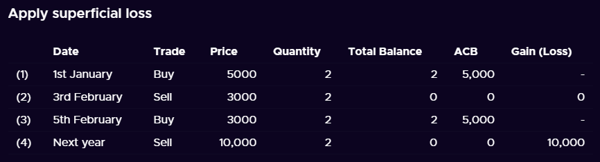

```{r, include = FALSE}
knitr::opts_chunk$set(
  collapse = TRUE,
  comment = "#>"
)
```

In this vignette, we will demonstrate that calculations of the adjusted cost base by `cryptoTax` closely follows those of https://www.adjustedcostbase.ca/.

# Basic ACB

To begin, we will replicate the basic ACB example showcased in https://www.adjustedcostbase.ca/blog/how-to-calculate-adjusted-cost-base-acb-and-capital-gains/


> 

We first generate the data:

```{r}
library(cryptoTax)
data <- data_adjustedcostbase1
data
```

Next, we generate the calculations to achieve the following result:

> 

```{r}
ACB(data, spot.rate = "price", sup.loss = FALSE)
```

# Superficial losses

We will now replicate the more advanced superficial loss example showcased at https://www.adjustedcostbase.ca/blog/what-is-the-superficial-loss-rule/.

## Example 1

We first demonstrate the "Violation of the Superficial Loss Rule" by using regular ACB *without* accounting for superficial losses:

> 

```{r}
data <- data_adjustedcostbase2
ACB(data, spot.rate = "price", sup.loss = FALSE)
```

Next, we do it the correct way, *accounting* for superficial losses:

> 

Per default, setting `sup.loss = TRUE` (the default) generates a lot of columns to provide as much information as possible. To make it look as short as the adjustedcostbase.ca example, we can subselect relevant columns:

```{r, message=FALSE}
library(dplyr)
ACB(data, spot.rate = "price") %>%
  select(date, transaction, quantity, price, total.quantity, ACB, ACB.share, gains)
```

## Example 2

We continue with the second superficial loss example. We first demonstrate the "Violation of the Superficial Loss Rule" by using regular ACB *without* accounting for superficial losses:

> 

```{r}
data <- data_adjustedcostbase3
ACB(data, spot.rate = "price", sup.loss = FALSE)
```

Next, we do it the correct way, *accounting* for superficial losses:

> 

```{r}
ACB(data, spot.rate = "price") %>%
  select(date, transaction, quantity, price, total.quantity, ACB, ACB.share, gains)
```

## Example 3

We continue with the third superficial loss example (first example in https://www.adjustedcostbase.ca/blog/applying-the-superficial-loss-rule-for-a-partial-disposition-of-shares/). We first demonstrate the "Violation of the Superficial Loss Rule" by using regular ACB *without* accounting for superficial losses:

### When Shares are Sold at a Loss and then Partially Reacquired within the Superficial Loss Period

> 

```{r}
data <- data_adjustedcostbase4
ACB(data, spot.rate = "price", sup.loss = FALSE)
```

Next, we do it the correct way, *accounting* for superficial losses:

> 

```{r}
ACB(data, spot.rate = "price") %>%
  select(date, transaction, quantity, price, total.quantity, ACB, ACB.share, gains)
```

## Example 4

We continue with the fourth superficial loss example (second example in https://www.adjustedcostbase.ca/blog/applying-the-superficial-loss-rule-for-a-partial-disposition-of-shares/). We first demonstrate the "Violation of the Superficial Loss Rule" by using regular ACB *without* accounting for superficial losses:

### When Shares are Purchased and then Partially Sold within the Superficial Loss Period

> 

```{r}
data <- data_adjustedcostbase5
ACB(data, spot.rate = "price", sup.loss = FALSE)
```

Next, we do it the correct way, *accounting* for superficial losses:

> 

```{r}
ACB(data, spot.rate = "price") %>%
  select(date, transaction, quantity, price, total.quantity, ACB, ACB.share, gains)
```

## Example 5

### When Multiple Acquisitions and/or Multiple Dispositions Occur Within the Superficial Loss Period

There are no examples given for this one, so we make our own. adjustedcostbase.ca writes that the web-based application does not support claiming partial losses automatically:

> Note that AdjustedCostBase.ca does not automatically apply the superficial loss rule for you.  Although you’ll see superficial loss rule warnings being displayed in many cases, it’s up to you to edit the transaction to apply the superficial loss rule.  Also, in cases where you’re partially claiming a loss due to the superficial loss rule, you’ll need to manually calculate the partial capital loss using the methods described above.

Fortunately, `cryptoTax` allows claiming partial losses automatically. We first demonstrate the "Violation of the Superficial Loss Rule" by using regular ACB *without* accounting for superficial losses:

```{r}
data <- data_adjustedcostbase6
ACB(data, spot.rate = "price", sup.loss = FALSE)
```

Next, we do it the correct way, *accounting* for superficial losses, and include a few more columns for the demonstration:

```{r}
ACB(data, spot.rate = "price") %>%
  select(
    date, transaction, quantity, price, total.quantity,
    suploss.range, sup.loss, sup.loss.quantity, ACB, ACB.share,
    gains.uncorrected, gains.sup, gains.excess, gains
  )
```

# Other examples from the internet

## CryptoTaxCalculator

### Example 1

Here is an example from CryptoTaxCalculator, showcased at: https://cryptotaxcalculator.io/guides/crypto-tax-canada-cra/. We first demonstrate the "Violation of the Superficial Loss Rule" by using regular ACB *without* accounting for superficial losses:

> 

```{r}
data <- data_cryptotaxcalculator1
ACB(data, transaction = "trade", spot.rate = "price", sup.loss = FALSE)
```

Next, we do it the correct way, *accounting* for superficial losses:

> 

```{r}
ACB(data, transaction = "trade", spot.rate = "price") %>%
  select(date, trade, price, quantity, total.quantity, ACB, ACB.share, gains)
```

### Example 2

We continue with the second superficial loss example. We first demonstrate the "Violation of the Superficial Loss Rule" by using regular ACB *without* accounting for superficial losses:

> 

```{r}
data <- data_cryptotaxcalculator2
ACB(data, transaction = "trade", spot.rate = "price", sup.loss = FALSE)
```

Next, we do it the correct way, *accounting* for superficial losses:

> 

```{r}
ACB(data, transaction = "trade", spot.rate = "price") %>%
  select(date, trade, price, quantity, total.quantity, ACB, ACB.share, gains)
```

## Coinpanda

### Example 1

Here is an example from Coinpanda, showcased at: https://coinpanda.io/blog/crypto-taxes-canada-adjusted-cost-base/. The first example does not require the superficial loss rule so we can set it to `FALSE` without worry.

> 
> 

```{r}
data <- data_coinpanda1
ACB(data,
  transaction = "type", quantity = "amount",
  total.price = "price", sup.loss = FALSE
)
```

### Example 2

We continue with the second superficial loss example. We first demonstrate the "Violation of the Superficial Loss Rule" by using regular ACB *without* accounting for superficial losses:

> 

```{r}
data <- data_coinpanda2
ACB(data,
  transaction = "type", quantity = "amount",
  total.price = "price", sup.loss = FALSE
)
```

Next, we do it the correct way, *accounting* for superficial losses:

> 

```{r}
ACB(data, transaction = "type", quantity = "amount", total.price = "price") %>%
  select(type, date, amount, price, fees, ACB, ACB.share, gains)
```

## Koinly

Here is an example from Koinly, showcased at: https://koinly.io/blog/calculating-crypto-taxes-canada/. We first demonstrate the "Violation of the Superficial Loss Rule" by using regular ACB *without* accounting for superficial losses:

> 

```{r}
data <- data_koinly
ACB(data, sup.loss = FALSE)
```

Next, we do it the correct way, *accounting* for superficial losses:

> 

```{r}
ACB(data) %>%
  select(date, transaction, quantity, spot.rate, total.quantity, ACB, ACB.share, gains)
```
